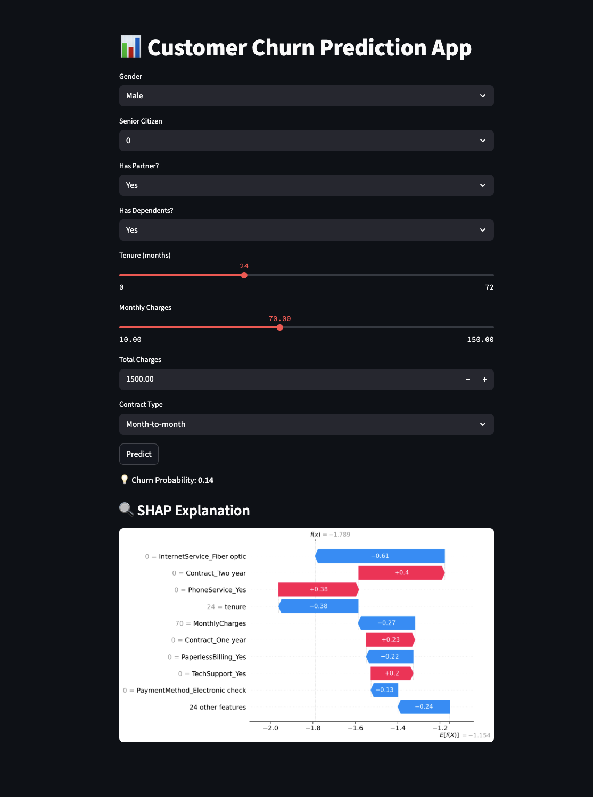

# churn-prediction-with-explainable-ai
# 📊 Customer Churn Prediction with Explainable AI

This project predicts whether a customer is likely to churn using machine learning and explains the reasons behind each prediction using SHAP (SHapley Additive Explanations). The model is deployed as an interactive Streamlit web app.

---

## 🚀 Live Demo

🌐 [Launch the App]([https://your-streamlit-link-here](https://churn-prediction-with-explainable-ai-hnkr5odzsqfkadua39xujq.streamlit.app/))  

---

## 🧠 Problem Statement

Customer churn is a major concern for subscription-based businesses. This project uses historical customer data to:

- Predict the probability of a customer churning
- Explain which features influenced that decision

---

## 💡 Key Features

- Logistic Regression, Random Forest, and XGBoost models
- Best model (XGBoost) achieves **ROC AUC ~ 84%**
- Feature engineering on contract types, tenure groups, etc.
- SHAP for **global + individual prediction explainability**
- Deployed Streamlit app with form-based input
- Reproducible and ready for production

---

## 🛠️ Tech Stack

- **Python**, **Pandas**, **NumPy**
- **scikit-learn**, **XGBoost**
- **SHAP** for interpretability
- **Matplotlib / Seaborn** for visualization
- **Streamlit** for deployment
- (Optional) **Ngrok** or **Streamlit Cloud** for public sharing

---

## 📊 Model Results

| Model               | Accuracy | Recall (Churn) | ROC AUC |
|--------------------|----------|----------------|---------|
| Logistic Regression | 80%      | 52%            | 0.84 ✅ |
| Random Forest       | 78%      | 48%            | 0.83    |
| XGBoost             | 79%      | 53%            | 0.82    |

---

## 🔍 SHAP Visualization

  

## 🔍 APP Visualization

  

---

